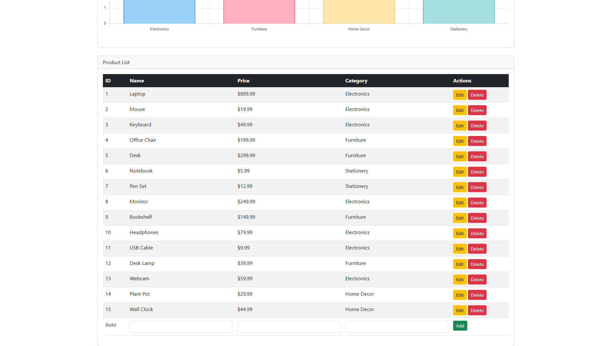
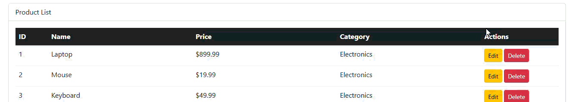
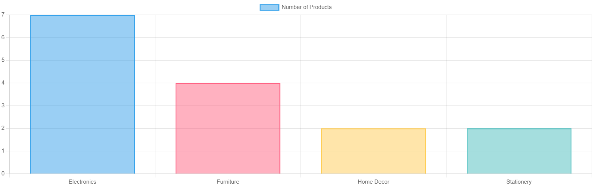

# Product Management System - PHP CRUD Application

A modern, responsive **Product Management System** built with PHP, MySQL, Bootstrap 5, and Chart.js. This application provides full CRUD (Create, Read, Update, Delete) functionality with an intuitive interface, in-place editing, real-time data visualization, and AJAX-powered operations.


## 🚀 Features

### Core Functionality

- ✨ **Full CRUD Operations**: Create, Read, Update, and Delete products
- 🔄 **In-Place Editing**: Edit records directly in the table without page reload
- 🗑️ **AJAX Delete**: Delete products with instant feedback using AJAX
- 📊 **Data Visualization**: Interactive Chart.js charts showing product categories
- 📱 **Responsive Design**: Mobile-friendly Bootstrap 5 interface
- ✅ **Input Validation**: Server-side validation with user-friendly error messages
- 🔒 **Security**: PDO prepared statements to prevent SQL injection, XSS protection

### Technical Highlights

- **AJAX-Powered**: Smooth user experience with asynchronous operations
- **Modular Architecture**: Organized file structure with separated concerns
- **Real-Time Updates**: Charts refresh after data changes
- **Error Handling**: Comprehensive error handling with JSON responses
- **Clean Code**: Well-documented, maintainable PHP code

## 📁 Project Structure

```txt
CRUD-table-php/
├── index.php                 # Main dashboard page
├── config/
│   ├── db.php               # Database connection (PDO)
│   └── schema.sql           # Database schema & sample data
├── includes/
│   ├── create.php           # Add new product handler
│   ├── update.php           # Update product AJAX handler
│   ├── delete.php           # Delete product AJAX handler
│   ├── get_chart_data.php   # Fetch data for charts
│   ├── header.php           # HTML header component
│   └── navbar.php           # Navigation bar component
├── assets/
│   ├── js/
│   │   ├── updateProducts.js    # In-place edit functionality
│   │   ├── deleteProducts.js    # Delete product logic
│   │   ├── displayChart.js      # Chart.js visualization
│   │   └── uiHelpers.js         # UI utility functions
│   └── css/
│       └── (custom styles)
└── README.md                # This file
```

## 🛠️ Installation

### Prerequisites

- **PHP** 7.4 or higher
- **MySQL** 5.7 or higher
- **Apache/XAMPP/WAMP** or any PHP web server
- Web browser (Chrome, Firefox, Safari, Edge)

### Step 1: Clone or Download

```bash
git clone https://github.com/yourusername/CRUD-table-php.git
cd CRUD-table-php
```

### Step 2: Database Setup

1. Start your MySQL server (XAMPP/WAMP/MAMP)
2. Create the database and import schema:

#### Option A: Using phpMyAdmin

- Open phpMyAdmin
- Create a new database named `digitaledu_db`
- Import `config/schema.sql`

#### Option B: Using MySQL Command Line

```bash
mysql -u root -p < config/schema.sql
```

### Step 3: Configure Database Connection

Edit `config/db.php` if your database credentials differ:

```php
define('DB_HOST', 'localhost');
define('DB_NAME', 'digitaledu_db');
define('DB_USER', 'root');
define('DB_PASS', '');  // Your MySQL password
```

### Step 4: Deploy Application

- Place the project in your web server's document root:
  - **XAMPP**: `C:\xampp\htdocs\CRUD-table-php`

### Step 5: Access the Application

Open your browser and navigate to:

```txt
http://localhost/CRUD-table-php/
```

## 📖 Usage Guide

### Adding a Product

1. Scroll to the bottom row of the table
2. Fill in the product details (Name, Price, Category)
3. Click the **Add** button
4. Success message will appear, and the chart will update

### Editing a Product (In-Place)

1. Click the **Edit** button on any product row
2. The row will transform into editable input fields
3. Modify the values as needed
4. Click **Save** to apply changes, or **Cancel** to discard
5. Changes are saved via AJAX without page reload

### Deleting a Product

1. Click the **Delete** button on any product row
2. Confirm the deletion in the dialog
3. The product is removed instantly via AJAX
4. Chart updates automatically

### Viewing Category Distribution

- The dashboard displays an interactive Chart.js visualization
- Shows the count of products per category
- Updates automatically after any data modification

## 🗄️ Database Schema

The application uses a single `products` table:

| Column      | Type           | Description                    |
|-------------|----------------|--------------------------------|
| `id`        | INT (PK)       | Auto-incrementing primary key  |
| `name`      | VARCHAR(255)   | Product name                   |
| `price`     | DECIMAL(10,2)  | Product price                  |
| `category`  | VARCHAR(100)   | Product category               |
| `created_at`| TIMESTAMP      | Record creation timestamp      |
| `updated_at`| TIMESTAMP      | Last update timestamp          |

## 🔒 Security Features

- **SQL Injection Prevention**: All queries use PDO prepared statements
- **XSS Protection**: `htmlspecialchars()` on all user inputs
- **Input Validation**: Server-side validation for all form submissions
- **Error Handling**: User-friendly messages without exposing sensitive data

## 🧩 Technology Stack

| Technology      | Purpose                          |
|-----------------|----------------------------------|
| **PHP 7.4+**    | Server-side logic                |
| **MySQL**       | Database management              |
| **PDO**         | Database abstraction layer       |
| **Bootstrap 5** | Responsive UI framework          |
| **Chart.js**    | Data visualization               |
| **JavaScript**  | Client-side interactivity        |
| **AJAX/Fetch**  | Asynchronous data operations     |

## 🎨 Features in Detail

### In-Place Editing System

The in-place editing feature provides a seamless user experience:

- Click **Edit** → Row converts to input fields
- **Save** → AJAX request updates database and UI
- **Cancel** → Restores original values without server request
- Visual feedback with success/error alerts

### AJAX Operations

All Update, and Delete operations use AJAX:

- No page reloads required
- Instant visual feedback
- JSON responses for clean error handling
- Chart auto-refresh after data changes

### Chart Visualization

- Displays category distribution using Chart.js
- Dynamically fetches data from `get_chart_data.php`
- Auto-updates after Update and Delete operations
- Responsive and interactive

## 🐛 Troubleshooting

### Database Connection Error

- Verify MySQL is running
- Check credentials in `config/db.php`
- Ensure `digitaledu_db` database exists

### AJAX Not Working

- Check browser console for JavaScript errors
- Verify file paths in includes
- Ensure PHP `file_get_contents('php://input')` is enabled

### Chart Not Displaying

- Verify Chart.js CDN is accessible
- Check `get_chart_data.php` returns valid JSON
- Open browser console to check for errors

## 📝 License

This project is licensed under the MIT License - see the [LICENSE](LICENSE) file for details.

## 🤝 Contributing

Contributions are welcome! Please feel free to submit a Pull Request.

1. Fork the project
2. Create your feature branch (`git checkout -b feature/AmazingFeature`)
3. Commit your changes (`git commit -m 'Add some AmazingFeature'`)
4. Push to the branch (`git push origin feature/AmazingFeature`)
5. Open a Pull Request

## 📧 Contact

For questions or support, please open an issue on GitHub.

## 🖼️ Images / Screenshots / Video




[Demo video](assets/video/demo.mp4) (optional)

## 🙏 Acknowledgments

- Bootstrap 5 for the responsive framework
- Chart.js for beautiful data visualizations
- PHP community for excellent documentation

---

<p align="center">
    Made with ❤️ using PHP, MySQL, and Bootstrap
</p>

A PHP application that implements a CRUD(Create, Read, Update, Delete) operations and implements a feature to visualize the data in a bar chart using Chart.js.
